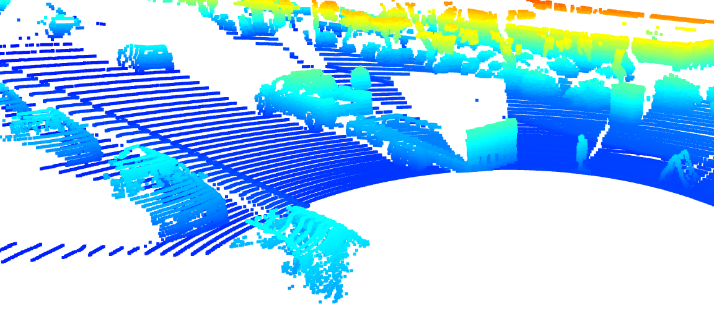

# Self-Driving Car Engineer Nanodegree 

This is a template submission for the midterm second course in the  [Udacity Self-Driving Car Engineer Nanodegree Program](https://www.udacity.com/course/self-driving-car-engineer-nanodegree--nd0013?promo=SUPER50&coupon=SUPER50&utm_source=gsem_brand&utm_medium=ads_r&utm_campaign=22049875362_c_individuals&utm_term=172849705615&utm_keyword=udacity%20self-driving%20car%20engineer_p&utm_source=gsem_brand&utm_medium=ads_r&utm_campaign=22049875362_c_individuals&utm_term=172849705615&utm_keyword=udacity%20self-driving%20car%20engineer_p&gad_source=1&gclid=CjwKCAiA2JG9BhAuEiwAH_zf3us7hnVYTwRrlEYojZfSswlRxH4H5zpHITXM1BiGXdQIEGXabuWOyxoC8PQQAvD_BwE) : 3D Object Detection (Midterm). 


# 3D Object Detection Project Requirements - Rubric

## 1. Compute Lidar Point-Cloud from Range Image
### Task 1.1: Visualize range image channels (ID_S1_EX1)
- Convert range image "range" channel to 8bit
- Convert range image "intensity" channel to 8bit
- Crop range image to +/- 90 deg. left and right of the forward-facing x-axis
- Stack cropped range and intensity image vertically and visualize the result using OpenCV

Here are the results of the range image visualization:


Here is the detail of the findings using the lidar intensity channel.
Stable features include the tail lights, the rear bumper  majorly. 
In some cases the additional features include the headover lights, car front lights, rear window shields. 
The chassis of the car is the most prominent identifiable feature from the lidar perspective. 


### Task 1.2: Visualize point-cloud (ID_S1_EX2)
- Visualize the point-cloud using the open3d module

### Task 1.3: Write-up Requirements
- Find 10 examples of vehicles with varying degrees of visibility in the point-cloud
- Identify vehicle features that appear stable in most of the inspected examples and describe them


Here are the results of the lidar point-cloud in a 3d viewer.

We can notice varying degrees of visibility in the point-cloud




## 2. Create Birds-Eye View from Lidar PCL
### Task 2.1: Convert sensor coordinates to bev-map coordinates (ID_S2_EX1)
- Convert coordinates in x,y [m] into x,y [pixel] based on width and height of the bev map


### Task 2.2: Compute intensity layer of bev-map (ID_S2_EX2)
- Assign lidar intensity values to the cells of the bird-eye view map
- Adjust the intensity in such a way that objects of interest (e.g. vehicles) are clearly visible

The corresponding intensity channel:


### Task 2.3: Compute height layer of bev-map (ID_S2_EX3)
- Make use of the sorted and pruned point-cloud `lidar_pcl_top` from the previous task
- Normalize the height in each BEV map pixel by the difference between max. and min. height
- Fill the "height" channel of the BEV map with data from the point-cloud


The corresponding normalized height channel:


## 3. Model-based Object Detection in BEV Image
### Task 3.1: Add a second model from a GitHub repo (ID_S3_EX1)
- In addition to Complex YOLO, extract the code for output decoding and post-processing from the GitHub repo

### Task 3.2: Extract 3D bounding boxes from model response (ID_S3_EX2)
- Transform BEV coordinates in [pixels] into vehicle coordinates in [m]
- Convert model output to expected bounding box format [class-id, x, y, z, h, w, l, yaw]

Here is the preview of the bounding box images on frame 50:


## 4. Performance Evaluation for Object Detection
### Task 4.1: Compute intersection-over-union (IOU) between labels and detections (ID_S4_EX1)
- For all pairings of ground-truth labels and detected objects, compute the degree of geometrical overlap
- The function `tools.compute_box_corners` returns the four corners of a bounding box which can be used with the Polygon structure of the Shapely toolbox
- Assign each detected object to a label only if the IOU exceeds a given threshold
- In case of multiple matches, keep the object/label pair with max. IOU
- Count all object/label-pairs and store them as "true positives"

### Task 4.2: Compute false-negatives and false-positives (ID_S4_EX2)
- Compute the number of false-negatives and false-positives based on the results from IOU and the number of ground-truth labels

### Task 4.3: Compute precision and recall (ID_S4_EX3)
- Compute "precision" over all evaluated frames using true-positives and false-positives
- Compute "recall" over all evaluated frames using true-positives and false-negatives

The precision recall curve is plotted showing similar results of precision = 0.9506 and recall = 0.9444


Here are the metrics on the ground truth labels setting the config parameter as follows:

```python
configs_det.use_labels_as_objects=True
```
 which results in precision and recall values as 1.This is shown in the following image:


## Summary of Lidar based 3D Object Detection

This project demonstrates the comprehensive pipeline for implementing and evaluating lidar-based 3D object detection for autonomous vehicles. Through systematic development and testing, several key insights emerged:

The conversion of raw lidar data to meaningful representations proved crucial for effective object detection. Starting with range image visualization, we identified stable vehicle features such as tail lights, rear bumpers, and chassis components. This preprocessing step established the foundation for reliable object detection.

The implementation of birds-eye-view (BEV) transformation provided a valuable perspective for object detection. By successfully converting sensor coordinates to BEV coordinates and computing both intensity and height layers, we created rich feature representations that enhanced the detection pipeline's effectiveness.

The integration of complex YOLO architecture for model-based detection demonstrated robust performance, achieving impressive metrics with a precision of 0.9506 and recall of 0.9444. These results validate the effectiveness of our implementation while highlighting the potential for real-world applications.

These numbers differed a bit from the expected exercise values of precision = 0.996 and recall = 0.8137. The difference could be due to the different configurations used in the exercises like updated model's weights or slightly different dataset.